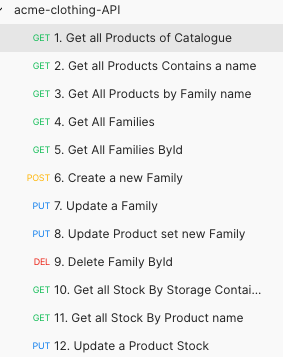

# Hexagonal Microservices architecture for Acme-Clothing-app

> API-REST Microservices with Spring Cloud Stack and multiple modules.

### Specs and Technologies

- **Java 11**
- **MongoDB**
- **Spring Cloud**
- **Api Gateway**
- **Eureka**
- **Docker compose**
- **Circuitbreaker**
- **RabbitMQ**
- **Sleuth/Zipkin**
- **Lombok**
- **Postman Collections**

###Pre requirements
* Install and run Mongo db server (with sufficient privileges. eg: in db path).
* Install Docker 
* Install Docker compose

###Roll out in order
 - Discovery-server
 - api-gateway
 - acme-clothing-app
 

####How to build entire project (package):
    
    (run build.sh) under /usr/local/javierprozapas/proyectos/microservices-acme-clothing folder.
    use:
    ./build.sh

###Docker

####How to build docker image per module:

    docker login (Optional step)
    cd api-gateway (folder)
    run : docker build -t jproza/api-gateway .
    cd discovery-server (folder)
    run: docker build -t jproza/discovery-server .
    cd acme-clothing-app (folder)
    run: docker build -t jproza/acme-clothing-app .

####How to push image into docker per module:

    use and run:
    docker push jproza/acme-clothing-app
    docker push jproza/api-gateway
    docker push jproza/discovery-server

###Docker Compose - Init the app modules/services
    run: docker compose in  acme-clothing-app folder
    use: docker-compose up

###PostMan 
> Collections in acme-clothing-API.postman_collection.json

    